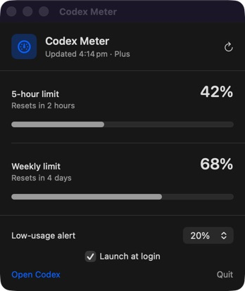

# Codex Meter

**Stop guessing when your Codex usage resets.**

[](https://github.com/TheJhyeFactor/codex-meter/releases/latest)
[](https://www.swift.org/)
[](LICENSE)
[](https://github.com/TheJhyeFactor/codex-meter/releases/latest)

Codex Meter is a free, open-source macOS menu bar app that shows how much Codex usage you have left and when it resets. No dashboard hunting, no guessing, and no extra account to create.

I built this because I wanted one simple answer sitting in the menu bar: **how much Codex do I have left?**



## What it does

- Shows the most constrained Codex allowance directly in the macOS menu bar.
- Breaks down every available usage window with a percentage and local reset time.
- Refreshes automatically every two minutes, with manual refresh when you want it.
- Warns you when remaining usage drops below 10%, 20%, or 30%.
- Detects stale or unavailable data instead of leaving a misleading old number visible.
- Supports launch at login without adding a Dock icon.
- Works natively on Apple silicon and Intel Macs.

## Download and install

1. Download the latest `Codex-Meter-*.zip` from [GitHub Releases](https://github.com/TheJhyeFactor/codex-meter/releases/latest).
2. Unzip it and move **Codex Meter.app** into `/Applications`.
3. Open it once. The gauge and remaining percentage will appear in your menu bar.

The current community build is ad-hoc signed, not Apple-notarized. If macOS blocks the first launch, Control-click the app in Finder, choose **Open**, then confirm **Open** once. The normal double-click flow works after that.

### Requirements

- macOS 13 Ventura or newer
- ChatGPT/Codex installed and signed in
- A Codex plan that returns rate-limit information

Codex Meter checks the ChatGPT app bundle and common Homebrew, npm, Volta, and local CLI locations. Developers launching from Terminal can also set `CODEX_PATH` to an absolute Codex executable path.

## Privacy by design

This app has one job and does not need your data for anything else.

- No analytics
- No ads
- No tracking
- No extra network service
- No copied or stored Codex credentials

Codex Meter starts the local `codex app-server` process and calls its read-only `account/rateLimits/read` method. It never reads `~/.codex/auth.json` and never calls the rate-limit reset action. See [the architecture notes](docs/architecture.md) for the full data flow.

## Build it yourself

You need the macOS Swift toolchain.

```sh
git clone https://github.com/TheJhyeFactor/codex-meter.git
cd codex-meter
SKIP_LIVE_CODEX_CHECK=1 ./scripts/test.sh
./scripts/build-app.sh
open "dist/Codex Meter.app"
```

Run `./scripts/test.sh` without the environment variable when Codex is installed and signed in to include the live integration check.

## Why open source?

A usage meter should be easy to inspect and easy to trust. You can see exactly what Codex Meter runs, how it reads the percentage, what it stores, and what it does not touch.

If you find a bug or have a practical improvement, [open an issue](https://github.com/TheJhyeFactor/codex-meter/issues) or read [CONTRIBUTING.md](CONTRIBUTING.md).

## Project status

Codex Meter tracks the local Codex app-server interface. That interface can change between Codex versions, so compatibility fixes may be needed as Codex evolves. Errors are shown honestly rather than replaced with estimated quota data.

## License

MIT licensed. Free to use, modify, and share. See [LICENSE](LICENSE).

---

Built and maintained by [Jhye / The Jhye Factor](https://github.com/TheJhyeFactor).

> Codex Meter is an independent community project. It is not affiliated with, endorsed by, or sponsored by OpenAI. Codex and OpenAI are trademarks of their respective owners.
